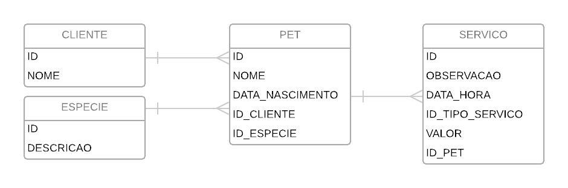

## Pet Store Spring REST API

  * ### Technical Specifications
    * **Programming Language:** Java | jdk1.8.0_152 (or higher)
    * **Dependency Manager:** apache-maven-3.6.0
    * **Spring Boot:** 2.1.2
    * **Database:** H2 database | http://localhost:8080/h2
    * **Unit Tests:** Mockito + JUnit
    * **Swagger**: [petstore.yaml](artefacts/petstore.yaml)
    * **Postman**: [PetStore.postman_collection.json](artefacts/PetStore.postman_collection.json)
    
  * ### Modeling
    

  * ### Representations

      All the input and output models are represented in JSON format

      * **Customer**

        *CustomerRequestDTO*
        ```json
        {
          "name": "Pedro"
        }
        ```

        *CustomerResponseDTO*
        ```json
        {
          "id": 1,
          "name": "Pedro"
        }
        ```
      * **Specie**

        *SpecieRequestDTO*
        ```json
        {
          "name": "Cachorro"
        }
        ```

        *SpecieResponseDTO*
        ```json
        {
          "id": 1,
          "name": "Cachorro"
        }
        ```
      * **Pet**

        *PetRequestDTO*
        ```json
        {
          "name": "Rex",
          "birthDate": "01/01/2019",
          "customerId": 1,
          "specieId": 1
        }
        ```

        *PetResponseDTO*
        ```json
        {
          "id": 1,
          "name": "Rex",
          "birthDate": "01/01/2019",
          "customer": {
            "id": 1,
            "name": "Pedro"
          },
          "specie": {
            "id": 1,
            "name": "Cachorro"
          }
        }
        ```
      * **Service**

        *ServiceRequestDTO*
        ```json
        {
          "observation": "Consulta",
          "serviceTypeId": 1,
          "value": 80.00,
          "petId": 1
        }
        ```

        *ServiceResponseDTO*
        ```json
        {
          "id": 1,
          "observation": "Consulta",
          "dateHour": "11/01/2019 12:38:17",
          "serviceType": "Consulta",
          "value": 80.00,
          "pet": {
            "id": 1,
            "name": "Rex",
            "birthDate": "01/01/2019",
            "customer": {
              "id": 1,
              "name": "Pedro"
            },
            "specie": {
              "id": 1,
              "name": "Cachorro"
            }
          }
        }
        ```

  * ### Requests

      * **Customer**

      Method | URL                                             | Input             | Output
      ------ | ----------------------------------------------- | ------------------- | ------ |
      POST   | http://localhost:8080/api/v1/customers           | *CustomerRequestDTO* | 201 (Created)
      GET    | http://localhost:8080/api/v1/customers           |                     | 200 (OK) List *CustomerResponseDTO*
      GET    | http://localhost:8080/api/v1/customers/{id}      |                     | 200 (OK) *CustomerResponseDTO*
      GET    | http://localhost:8080/api/v1/customers/{id}/pets |                     | 200 (OK) List *PetResponseDTO*
      PUT    | http://localhost:8080/api/v1/customers/{id}      | *CustomerRequestDTO* | 204 (No Content)
      DELETE | http://localhost:8080/api/v1/customers/{id}      |                     | 204 (No Content)

      * **Specie**

      Method | URL                                             | Input             | Output
      ------ | ----------------------------------------------- | ------------------- | ------ |
      POST   | http://localhost:8080/api/v1/species           | *SpecieRequestDTO* | 201 (Created)
      GET    | http://localhost:8080/api/v1/species           |                     | 200 (OK) List *SpecieResponseDTO*
      GET    | http://localhost:8080/api/v1/species/{id}      |                     | 200 (OK) *SpecieResponseDTO*
      GET    | http://localhost:8080/api/v1/species/{id}/pets |                     | 200 (OK) List *PetResponseDTO*
      PUT    | http://localhost:8080/api/v1/species/{id}      | *SpecieRequestDTO* | 204 (No Content)
      DELETE | http://localhost:8080/api/v1/species/{id}      |                     | 204 (No Content)

      * **Pet**

      Method | URL                                             | Input          | Output
      ------ | ----------------------------------------------- | ---------------- | ------ |
      POST   | http://localhost:8080/api/v1/pets               | *PetRequestDTO*  | 201 (Created)
      GET    | http://localhost:8080/api/v1/pets               |                  | 200 (OK) List *PetResponseDTO*
      GET    | http://localhost:8080/api/v1/pets/{id}          |                  | 200 (OK) *PetResponseDTO*
      GET    | http://localhost:8080/api/v1/pets/{id}/services |                  | 200 (OK) List *ServiceResponseDTO*
      PUT    | http://localhost:8080/api/v1/pets/{id}          | *PetRequestDTO*  | 204 (No Content)
      DELETE | http://localhost:8080/api/v1/pets/{id}          |                  | 204 (No Content)

      * **Service**

      Method | URL                                             | Input             | Output
      ------ | ----------------------------------------------- | ------------------- | ------ |
      POST   | http://localhost:8080/api/v1/services      	   | *ServiceRequestDTO* | 201 (Created)
      GET    | http://localhost:8080/api/v1/services      	   |                     | 200 (OK) List *ServiceResponseDTO*
      GET    | http://localhost:8080/api/v1/services/{id} 	   |                     | 200 (OK) *ServiceResponseDTO*
      GET    | http://localhost:8080/api/v1/services/findByDate?initialDate=dd/MM/yyyy&finalDate=dd/MM/yyyy |                     | 200 (OK) List *ServiceResponseDTO*
      PUT    | http://localhost:8080/api/v1/services/{id} 	   | *ServiceRequestDTO* | 204 (No Content)
      DELETE | http://localhost:8080/api/v1/services/{id} 	   |                     | 204 (No Content)
